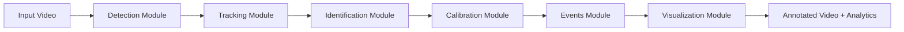
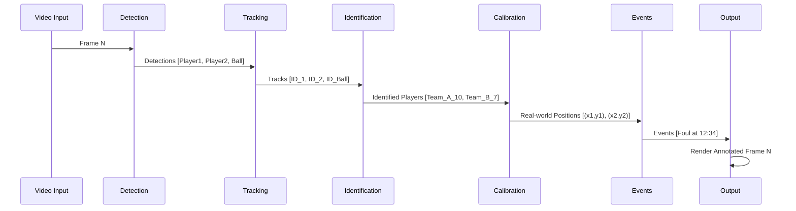
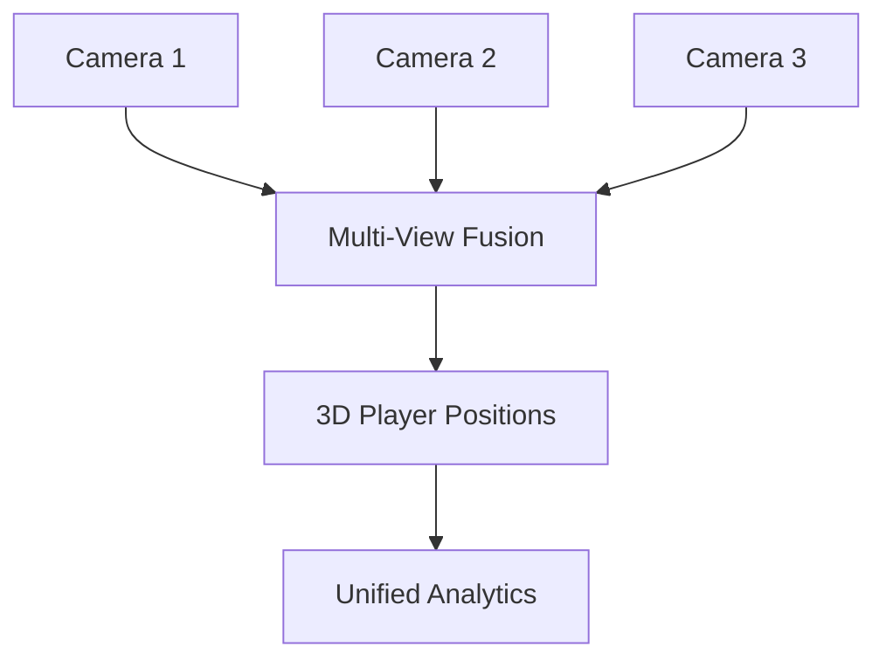

# Football Analytics Pro - System Architecture

## 🎯 System Overview

Football Analytics Pro is a modular, production-grade computer vision pipeline designed for automated football match analysis. The system follows a **data flow architecture** where raw video passes through sequential processing stages: detection → tracking → identification → event analysis → visualization.



## 🏛️ Core Design Principles

1. **Modularity** - Each component is independent and can be tested/improved separately
2. **Configuration-Driven** - All parameters externalized to YAML for easy tuning
3. **Scalability** - Designed for batch processing and future real-time optimization
4. **Security** - Input validation, secure file handling, no arbitrary code execution
5. **Maintainability** - Clean code, comprehensive logging, type hints

## 📦 Module Descriptions

### 1. Detection Module (`src/detection/`)

**Purpose**: Detect objects of interest (players, ball, referees) in each video frame

**Technology**: YOLOv8x (Extra-Large variant for maximum accuracy)

**Key Components**:
- `detector.py` - Wrapper around Ultralytics YOLOv8
- Confidence thresholding (configurable, default 0.5)
- NMS (Non-Maximum Suppression) for overlapping boxes
- Multi-class detection: person, sports ball

**Input**: Video frame (NumPy array)

**Output**: Bounding boxes with class labels and confidence scores

**Future Enhancements**:
- YOLOv8-Pose for skeleton keypoints (foul detection)
- Multi-scale detection for distant players
- TensorRT optimization for GPU inference

---

### 2. Tracking Module (`src/tracking/`)

**Purpose**: Maintain persistent IDs for detected objects across frames

**Technology**: DeepSORT (primary), OC-SORT (alternative)

**Key Components**:
- `tracker.py` - DeepSORT implementation with Kalman filtering
- Re-identification network for appearance matching
- Configurable max age (30 frames) and initialization threshold (3 frames)

**Input**: Per-frame detections from Detection Module

**Output**: Track IDs with bounding box trajectories

**Algorithms**:
1. **Kalman Filter** - Predict next position based on velocity
2. **Hungarian Algorithm** - Optimal detection-to-track assignment
3. **Deep Appearance Descriptor** - Re-identify players after occlusion

**Future Enhancements**:
- ByteTrack for high-speed scenarios
- Custom Re-ID model trained on football datasets
- Multi-camera tracking with homography alignment

---

### 3. Identification Module (`src/identification/`)

**Purpose**: Assign team labels and recognize player jersey numbers

**Technology**: PaddleOCR + K-means clustering

**Key Components**:

#### Team Assignment
- `team_classifier.py` - Extract jersey color from bounding box
- K-means clustering (K=2) on HSV color space
- Spatial filtering to separate teams + referees

#### Player Number Recognition
- `ocr_reader.py` - PaddleOCR for jersey number extraction
- Runs every N frames (configurable, default 30) to save compute
- Temporal smoothing: most frequent number over 5 seconds = player ID

**Input**: Tracked players with bounding boxes

**Output**: Team ID (Team A, Team B, Referee) + Player Number

**Challenges & Solutions**:
- **Motion blur** → Sample frames with low optical flow
- **Occlusion** → Only run OCR when full jersey visible (bounding box aspect ratio check)
- **Lighting variations** → Adaptive histogram equalization pre-processing

---

### 4. Calibration Module (`src/calibration/`)

**Purpose**: Map pixel coordinates to real-world pitch positions

**Technology**: Homography transformation using pitch line detection

**Key Components**:
- `pitch_detector.py` - Detect pitch lines using Hough Line Transform
- `homography.py` - Compute transformation matrix from pixel → meters
- Standard pitch dimensions: 105m × 68m (configurable)

**Process**:
1. Detect pitch boundary and center circle
2. Match detected lines to template pitch model
3. Compute homography matrix (OpenCV `findHomography`)
4. Apply transformation to player positions

**Output**: Real-world (x, y) coordinates for each player

**Use Cases**:
- Bird's eye view visualization
- Accurate speed/distance calculations
- Formation analysis

---

### 5. Events Module (`src/events/`)

**Purpose**: Detect fouls, penalties, and significant match events

**Technology**: Rule-based + ML hybrid approach

**Planned Components**:

#### Rule-Based Detection
- **Offside** - Check player positions relative to last defender
- **Out of bounds** - Ball position vs. pitch boundaries
- **Corner/Goal kick** - Ball trajectory analysis

#### ML-Based Detection (Future)
- **Fouls** - Classify player-player interactions using pose keypoints
  - Features: Relative distance, velocity, contact detection
  - Model: XGBoost or lightweight CNN
- **Penalty warnings** - Detect aggressive gestures or slide tackles

**Input**: Player positions, ball trajectory, pose keypoints

**Output**: Event type, timestamp, involved players

---

### 6. Visualization Module (`src/visualization/`)

**Purpose**: Render annotated videos and generate analytics dashboards

**Technology**: Supervision library + Matplotlib

**Key Components**:
- `annotator.py` - Draw bounding boxes, track IDs, team colors
- `heatmap.py` - Generate player movement heatmaps
- `stats.py` - Calculate possession, distance covered, speed profiles

**Outputs**:
1. **Annotated Video** - MP4 with overlays (boxes, IDs, speeds)
2. **Bird's Eye View** - Top-down pitch visualization
3. **Analytics Dashboard** - HTML report with charts
   - Possession percentage
   - Player heatmaps
   - Speed vs. time graphs
   - Event timeline

---

### 7. Utilities Module (`src/utils/`)

**Purpose**: Shared functionality across all modules

**Key Components**:
- `logger.py` - Colored console logging with timestamps ✅ **[Implemented]**
- `config.py` - YAML configuration parser (planned)
- `video_io.py` - Optimized video reading/writing (planned)
- `metrics.py` - Performance profiling (planned)

---

## 🔄 Data Flow Example



## 🔧 Configuration Architecture

All modules are controlled via `configs/config.yaml`:

```yaml
project:
  name: FootballAnalytics_Pro
  version: 2.0.0
  
detection:
  model_path: models/yolov8x.pt
  confidence_threshold: 0.5
  
tracking:
  tracker_type: deepsort
  max_age: 30
  
identification:
  ocr_model_lang: en
  team_cluster_method: kmeans
```

**Benefits**:
- No code changes for parameter tuning
- Easy A/B testing of configurations
- Version-controlled experiment tracking

## 🛡️ Security Considerations

1. **Input Validation**
   - Verify video file formats (whitelist: .mp4, .avi, .mov)
   - Sanitize file paths to prevent directory traversal
   - Limit video resolution/duration to prevent DoS

2. **Dependency Management**
   - Pinned versions in `requirements.txt`
   - Regular security audits (Dependabot/Snyk)
   - No dynamic code execution (`eval`, `exec` prohibited)

3. **Output Safety**
   - Sandboxed output directory
   - No PII logging (player names pseudonymized)
   - Secure file permissions on generated reports

## 📊 Performance Optimization Strategy

### Current State (CPU)
- **Detection**: ~0.5 FPS (YOLOv8x on CPU)
- **Tracking**: ~5 FPS overhead
- **Total**: ~0.3 FPS end-to-end

### Target State (GPU + Optimizations)
- **Detection**: ~30 FPS (YOLOv8x TensorRT on RTX 3090)
- **Tracking**: ~60 FPS (optimized DeepSORT)
- **Total**: ~25 FPS (real-time capable)

### Optimization Roadmap
1. **Phase 1**: TensorRT conversion for YOLO
2. **Phase 2**: Multi-process pipeline (detection + tracking parallel)
3. **Phase 3**: Frame skipping for non-critical modules (OCR every 30 frames)
4. **Phase 4**: Model quantization (INT8 precision)

## 🚀 Future Architecture Enhancements

### Multi-Camera Support


### Cloud Deployment
- **Containerization**: Docker + Kubernetes
- **Scalability**: Horizontal scaling for batch processing
- **API**: RESTful endpoints for video upload/analysis
- **Storage**: S3-compatible object storage for videos/results

### Advanced Analytics
- **Tactical Analysis**: Formation detection, pressing intensity
- **xG (Expected Goals)**: Shot quality assessment
- **Pass Networks**: Team coordination visualization
- **Predictive Models**: Injury risk, match outcome prediction

---

## 📚 References

- [YOLOv8 Documentation](https://docs.ultralytics.com/)
- [DeepSORT Paper](https://arxiv.org/abs/1703.07402)
- [PaddleOCR GitHub](https://github.com/PaddlePaddle/PaddleOCR)
- [Supervision Library](https://github.com/roboflow/supervision)
